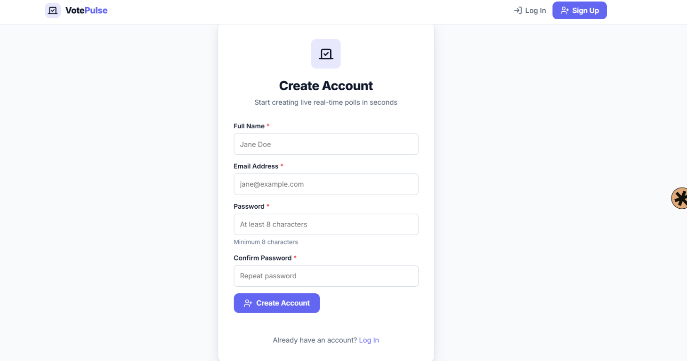
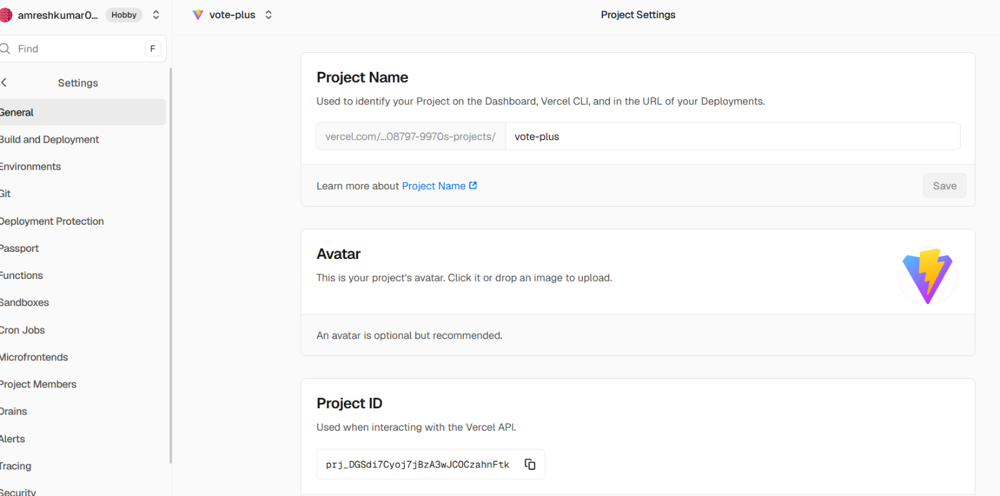
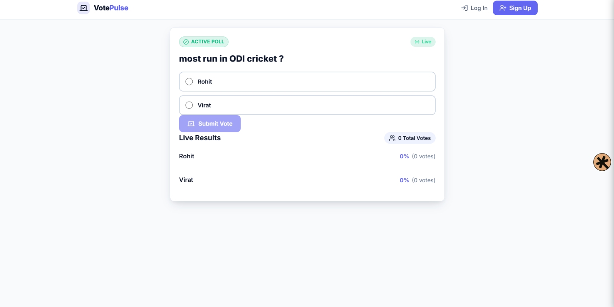
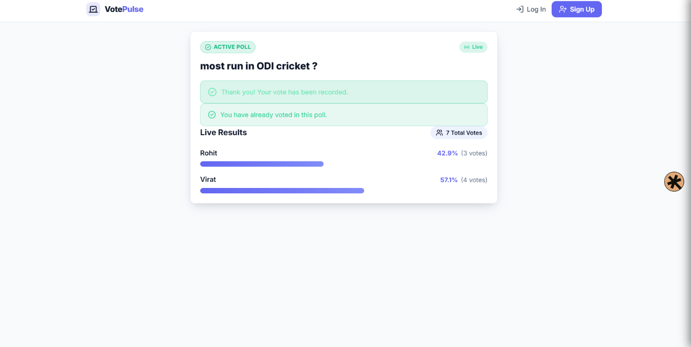
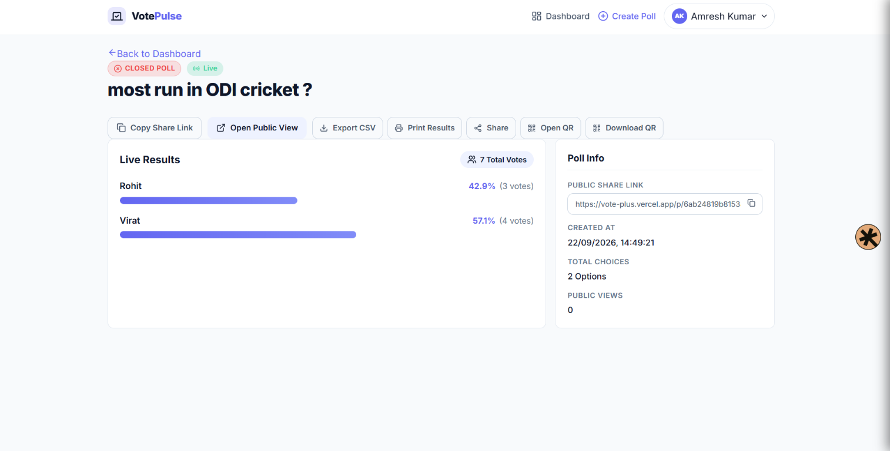
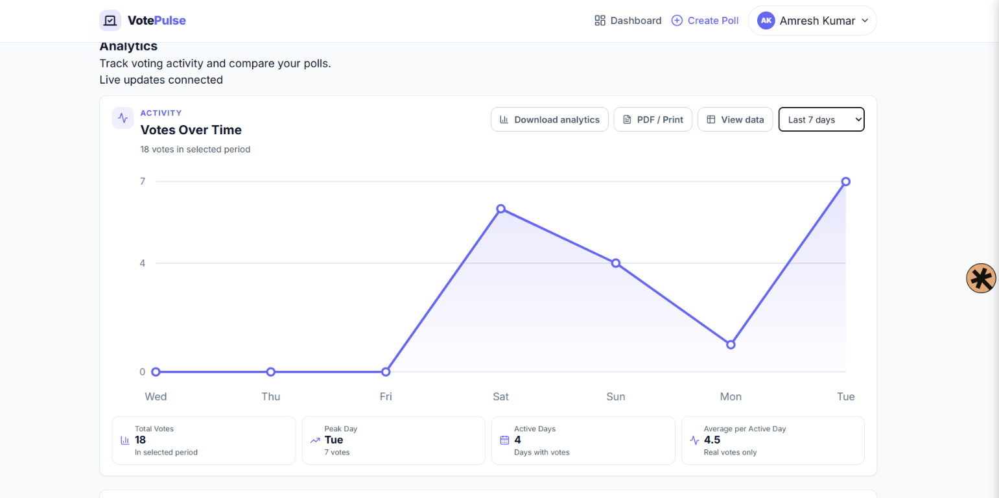

# Live Polling Tool — Backend (Go + Gin + MongoDB + Redis + WebSockets)

A full-stack, production-quality live polling application backend built as part of a developer internship assignment.

## ✨ Core Flow

```
Create Poll → Share Link → Audience Votes → Live Results (no page refresh)
```

## 📸 Application Walkthrough

VotePulse provides a simple real-time polling experience from account creation
to live analytics.

### 1. Create an Account

Users can create a VotePulse account with their name, email address, and password.



### 2. Login

Existing users can securely log in to access their polls and dashboard.



### 3. Open a Public Poll

Anyone with a shared poll link can open the public poll and participate.



### 4. Submit a Vote

After selecting an option, a voter can submit a vote. VotePulse prevents the
same voter from voting multiple times in the same poll.



### 5. Live Results

Vote results update in real time, showing totals and percentages for each option.


### 6. Poll Dashboard

Poll creators can manage polls, view results, share links, export data, print
results, and generate QR codes.



### 7. Analytics

The analytics dashboard shows voting activity over time, total votes, peak
voting day, active days, and average votes per active day.



## 🧰 Tools & Technologies

The main tools used to build, run, and deploy VotePulse:

<p align="center">
  <a href="https://go.dev/"></a>
  <a href="https://gin-gonic.com/"></a>
  <a href="https://react.dev/"></a>
  <a href="https://vite.dev/"></a>
</p>
<p align="center">
  <a href="https://www.mongodb.com/"></a>
  <a href="https://redis.io/"></a>
  <a href="https://developer.mozilla.org/en-US/docs/Web/API/WebSockets_API"></a>
  <a href="https://www.docker.com/"></a>
</p>
<p align="center">
  <a href="https://github.com/"></a>
  <a href="https://vercel.com/"></a>
  <a href="https://render.com/"></a>
</p>

## 🛠 Technology Stack Architecture

| Component | Technology | Role & Purpose |
|-----------|------------|----------------|
| **MongoDB** | MongoDB 6+ | **Persistent Source of Truth**: Permanent storage for users, polls, options, and individual votes with unique index duplicate prevention. |
| **Redis** | Redis 7+ | **Realtime Cache & Pub/Sub**: In-memory vote count hash caching (`poll:{id}:votes`) and Pub/Sub channel (`poll:{id}:updates`) for fast, non-blocking update propagation. |
| **WebSocket** | Gorilla WebSocket | **Live Delivery**: Low-latency, bi-directional persistent connections streaming live vote updates directly to browser clients watching a poll. |
| **Backend API** | Go 1.23 + Gin 1.10 | REST API, authentication middleware, voting validation, Redis integration, and WebSocket hub coordination. |

---

## ⚡ Realtime Architecture & Vote Flow

```
User Vote Request
     │
     ▼
[1] Validate Poll & Option (MongoDB)
     │
     ▼
[2] Prevent Duplicate Vote (MongoDB Unique Index on PollID + VoterToken)
     │
     ▼
[3] Persist Vote to MongoDB (Source of Truth)
     │
     ├───► [MongoDB Success] ───► HTTP 201 Created Response
     │
     ▼ (Async Goroutine)
[4] Increment Redis Vote Hash (HINCRBY poll:{pollID}:votes optionID 1)
     │
     ▼
[5] Publish to Redis Pub/Sub (PUBLISH poll:{pollID}:updates <JSON>)
     │
     ▼
[6] WebSocket Hub Listens & Broadcasts to Connected Clients
     │
     ▼
[7] Browsers update poll counts dynamically without page refresh!
```

> **Note on Fault Tolerance**: MongoDB persistence ALWAYS occurs before Redis cache/pubsub processing. If Redis is down or fails, the vote remains safely stored in MongoDB, and Redis counts are dynamically rebuilt on demand from MongoDB when clients query or connect to the poll.

---

## 📁 Project Structure

```
live-polling-app/
├── frontend/               # React + Vite SPA
└── backend/                # Go + Gin REST API
    ├── cmd/
    │   └── server/
    │       └── main.go     # Entry point (`go run ./cmd/server`)
    ├── config/             # Config loading & env vars (config.go)
    ├── database/           # MongoDB pool (`mongodb.go`) & Redis client (`redis.go`)
    ├── controllers/        # HTTP handlers (health, auth, poll, vote)
    ├── middleware/         # Auth JWT guard, VoterIdentity cookie middleware, CORS, recovery
    ├── models/             # Data models & schemas (User, Poll, Vote, Option)
    ├── services/           # Business logic (AuthService, PollService, VoteService)
    ├── websocket/          # WebSocket Hub (`hub.go`), Client (`client.go`), Handler (`handler.go`), Message format (`message.go`)
    ├── routes/             # Gin router setup (/api/v1 routes)
    ├── main.go             # Convenience alias (`go run .`)
    ├── go.mod
    └── .env.example        # Env variable template
```

---

## 📡 WebSocket Endpoint & Message Format

### Connection Endpoint
```http
GET /api/v1/public/polls/:id/ws
```
- **Authentication**: Public (None required).
- **Behavior**:
  1. Upgrades HTTP connection to WebSocket protocol (`ws://` or `wss://`).
  2. Validates poll existence in MongoDB.
  3. Initializes or reads vote counts from Redis (falling back to MongoDB if hash missing).
  4. Immediately sends current vote state to client (`poll_update` message).
  5. Subscribes client connection to Redis Pub/Sub topic `poll:{pollID}:updates`.

### Realtime Message Format
All WebSocket updates sent from server to client use JSON formatting:

```json
{
  "type": "poll_update",
  "pollId": "650000000000000000000001",
  "counts": {
    "65000000000000000000000a": 10,
    "65000000000000000000000b": 7,
    "65000000000000000000000c": 3
  },
  "totalVotes": 20
}
```

---

## ⚙️ Environment Variables

Copy `.env.example` to `.env`:

```ini
PORT=8080
APP_ENV=development
ALLOWED_ORIGIN=http://localhost:5173

# MongoDB Configuration
MONGODB_URI=mongodb://localhost:27017
MONGODB_DATABASE=live_polling

# Redis Configuration
REDIS_URL=localhost:6379
REDIS_PASSWORD=
REDIS_DB=0

# Development / Offline Flags (Set true to test without external services)
SKIP_DB=false
SKIP_REDIS=false

# JWT Authentication
JWT_SECRET=change_me_in_production_super_secret_key_32bytes
JWT_EXPIRATION=24h

# Password reset testing only. Keep false in production unless token exposure is intentional.
EXPOSE_RESET_TOKEN=false
```

---

## 🚀 How to Run Redis & MongoDB Locally

### Using Docker (Recommended)
```bash
# Start MongoDB & Redis via docker
docker run -d --name mongo-polling -p 27017:27017 mongo:latest
docker run -d --name redis-polling -p 6379:6379 redis:alpine
```

### Direct Local Installation
- **MongoDB**: Ensure `mongod` is running on `localhost:27017`.
- **Redis**: Ensure `redis-server` is running on `localhost:6379`.

---

## 🧪 Running Tests

Run unit & integration test suite:

```bash
cd backend
go test -v ./...
```

Run static analysis & build checks:

```bash
go fmt ./...
go vet ./...
go build ./...
```

---

## 🖥️ Two-Browser Realtime Manual Test Instructions

To verify live real-time voting results across clients:

1. **Start Backend Server**:
   ```bash
   cd backend
   go run ./cmd/server
   ```
2. **Create a Poll**:
   - Authenticate & `POST /api/v1/polls` to create a poll with options A, B, and C.
   - Copy the returned `id` (e.g. `650000000000000000000001`).

3. **Open Two Browser Windows**:
   - **Browser A** (Normal Window): Connect WebSocket to `ws://localhost:8080/api/v1/public/polls/6500.../ws` (or view frontend poll page).
   - **Browser B** (Incognito/Private Window): Connect WebSocket to the same URL.

4. **Observe Initial State**:
   - Both browsers immediately receive current vote counts (e.g. Total: 0).

5. **Submit a Vote in Browser A**:
   - Send `POST /api/v1/public/polls/6500.../vote` with `optionId: "..."`.
   - **Browser B** receives a `poll_update` message and updates options instantly without page refresh!

6. **Submit a Vote in Browser B**:
   - Send `POST /api/v1/public/polls/6500.../vote` from Browser B (different voter token).
   - **Browser A** receives the live update instantly!
